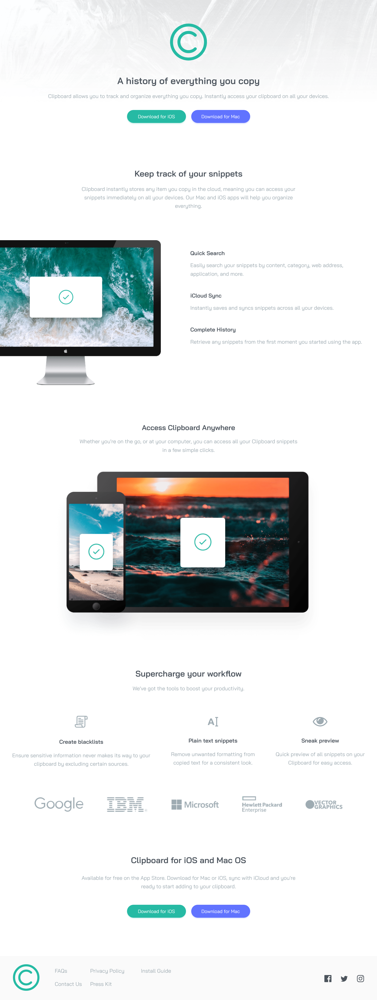

# Frontend Mentor - Clipboard landing page solution

This is a solution to the [Clipboard landing page challenge on Frontend Mentor](https://www.frontendmentor.io/challenges/clipboard-landing-page-5cc9bccd6c4c91111378ecb9). Frontend Mentor challenges help you improve your coding skills by building realistic projects. 

## Table of contents

- [Overview](#overview)
  - [The challenge](#the-challenge)
  - [Screenshot](#screenshot)
  - [Links](#links)
- [My process](#my-process)
  - [Built with](#built-with)
  - [What I learned](#what-i-learned)
  - [Useful resources](#useful-resources)
- [Author](#author)


## Overview

### The challenge

Users should be able to:

- View the optimal layout for the site depending on their device's screen size
- See hover states for all interactive elements on the page

### Screenshot




### Links

- Solution URL: [Solution URL here](https://www.frontendmentor.io/solutions/clipboard-landing-page-html-sass-L16t3VR2By)
- Live Site URL: [Live site URL here](https://limsael.github.io/clipboard-landing-page/)

## My process

### Built with

- Semantic HTML5 markup
- CSS custom properties
- Flexbox
- CSS Grid
- Mobile-first workflow


### What I learned


```css
.footer img:hover {
  filter: invert(60%) sepia(77%) saturate(367%) hue-rotate(122deg) brightness(85%) contrast(100%);
}
```

### Useful resources

- [Stackoverflow](https://stackoverflow.com) 
- [Change SVG Color](https://codepen.io/sosuke/pen/Pjoqqp) 


## Author

- Frontend Mentor - [@limsael](https://www.frontendmentor.io/profile/limsael)
- Twitter - [@limsael525](https://www.twitter.com/limsael525)

